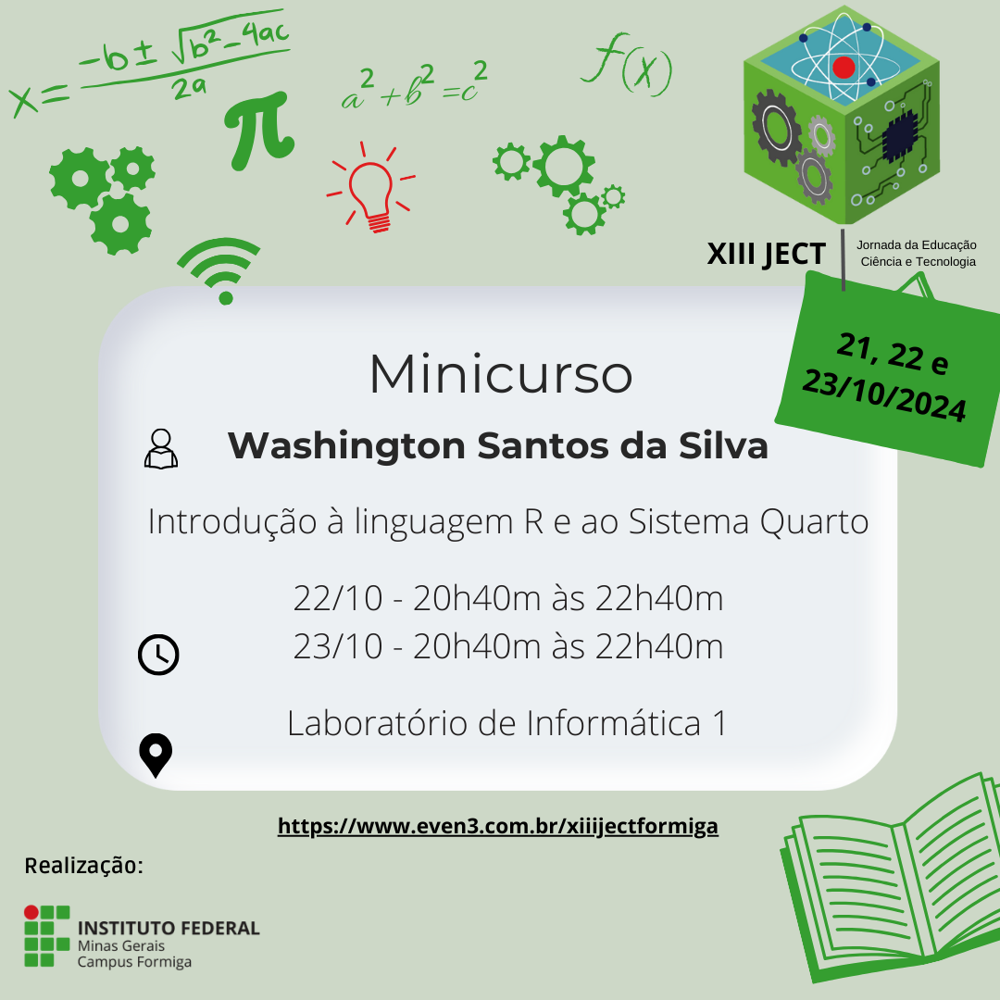

# Workshop: Introdução à Linguagem R e ao Sistema Quarto

Bem-vindo ao *Workshop de Introdução à Linguagem R e ao Sistema Quarto*, que 
será realizado durante a **XIII Jornada de Educação, Ciência e Tecnologia** 
do IFMG - Campus Formiga, nos dias **22/10/2024** e **23/10/2024**.

Este repositório contém todos os arquivos e recursos necessários para 
acompanhar o workshop.

## Como Baixar o Conteúdo

1. Clique no botão verde **"Code"** no topo da página do repositório.
2. Selecione a opção **"Download ZIP"**.
3. Após o download, descompacte o arquivo no seu computador.

Dentro do repositório, você encontrará a pasta `13ject_minicurso`, que 
contém o projeto do RStudio. Para abri-lo, basta seguir um dos passos abaixo:

- **Opção 1**: Clique duas vezes no arquivo `13ject_minicurso.Rproj`.
- **Opção 2**: Abra o RStudio, vá em **"File"** > **"Open Project"** e \
               selecione o arquivo `13ject_minicurso.Rproj`.

> **Nota**: Caso apareça uma pasta chamada `MACOSX` após descompactar o arquivo, você pode apagá-la sem problemas.

---

## Tópicos Abordados

### **Dia 1: Curso Relâmpago sobre R + RStudio + Quarto**
- **Atividade**: Implementação do ciclo completo de Análise de Dados com R, RStudio e Quarto.

### **Dia 2: Quarto Dashboards e Aplicativos Web**
- **Quarto Dashboards**: Desenvolvimento de dashboards interativos.
- **Aplicativos Web com Shiny**: Introdução ao Shiny para criação de aplicativos web dinâmicos.
- **Dashboards com Shiny e Shinydashboard**: Criação de dashboards customizados utilizando os pacotes `shiny` e `shinydashboard`.

---

## Estrutura do Repositório

- **dados**: Contém o arquivo `dados_vendas.csv` para ser utilizado durante o workshop.
- **dia01**: Arquivos relacionados às atividades do primeiro dia.
- **dia02**: Arquivos relacionados às atividades do segundo dia.
- **resumos**: Cheatsheets da linguagem R, Quarto e diversos pacotes úteis.
- **slides**: Apresentações utilizadas ao longo do workshop.

